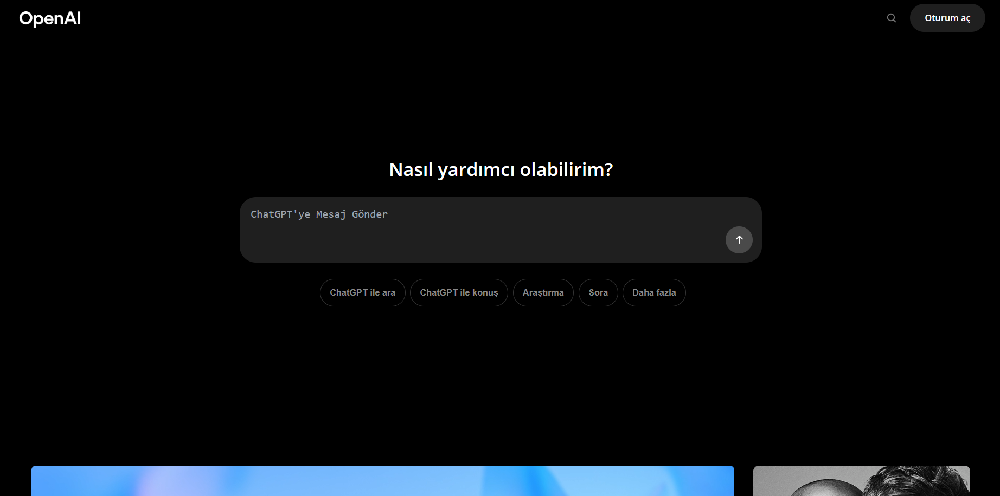

# OpenAI Ana Sayfa Tasarımı

Bu proje, OpenAI'nin ana sayfasının benim tarafımdan OpenAI'ın direktiflere uygun şekilde geliştirilmiş bir versiyonudur. Modern web teknolojileri kullanılarak **React & Vite** ile geliştirilmiştir.  

Sitenin Bağlantısı: [https://gg-openai.vercel.app](https://gg-openai.vercel.app)
## 📸 Önizleme

  

## ⚡ Özellikler

- OpenAI ana sayfasının tasarımına sadık.
- Responsive tasarım (mobil, tablet ve desktop uyumlu).
- Hızlı ve modern Vite altyapısı.

## 🚀 Kurulum & Çalıştırma

Projeyi lokal ortamında çalıştırmak için şu adımları takip et:

```bash
# 1. Repo'yu klonlayın
git clone https://github.com/gorkemgozen/openai-landing-page.git

# 2. Proje dizinine girin
cd openai-landing-page

# 3. Bağımlılıkları yükleyin
npm install

# 4. Projeyi başlatın
npm run dev
